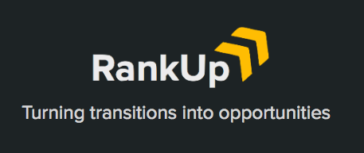

  <b>MSC Rewind Hackathon @ MSFT</b> - Redmond, WA - November 8-9, 2019

### Motivation
Military spouses often have to sacrifice long-term career goals in their support of their family and partners in the military. According to the Rand Corporation they are typically underemployed and underpaid much more than their civilian counterparts.

### Our Project
Using the latest Natural Language Processing (NLP) & deep learning machine learning techniques, we curate personalized lists of jobs for military spouses that are ranked by analyzing their resume. Furthermore, we offer recommendations for education resources and a "path of least resistance" to change one's career and maximize salary gain.

### Team
* Abhi Banerjee
* Anna Meeks
* Chris Ihler

### Links
- Presentation Slides: http://bit.ly/2K5rYbw
- GitHub: https://github.com/drunkONdata/RankUp.vet

### Unique Features
* Scrapes web of salary, syllabi, job descriptions & most marketable jobs for destination city
* Identify opportunities for career changes based on current skills with NLP + DL
* Provisional Patent submitted to USPTO for recommendation engine - Nov 8th 2019
* Resume Text Sentiment Classifer using Bidirectional RNN via Keras + Tensorflow

### Future Work
* Expand to veterans looking to rejoin the workforce & civilians 
* Expand training dataset repository for ML/DL model training
* Model hyperparameter improvements for better ranked matches
* Utilize ML to decode & translate military jargon to civilian keywords
* Train CNN for resume “attractiveness” score for passing initial resume screen
* Expand offerings for scholarship & grant recommendations
* Apply to Techstars Seattle 2020

### MIT License
Copyright (c) 2019 RankUp.vet

The above copyright notice and this permission notice shall be included in all
copies or substantial portions of the Software.

THE SOFTWARE IS PROVIDED "AS IS", WITHOUT WARRANTY OF ANY KIND, EXPRESS OR
IMPLIED, INCLUDING BUT NOT LIMITED TO THE WARRANTIES OF MERCHANTABILITY,
FITNESS FOR A PARTICULAR PURPOSE AND NONINFRINGEMENT. IN NO EVENT SHALL THE
AUTHORS OR COPYRIGHT HOLDERS BE LIABLE FOR ANY CLAIM, DAMAGES OR OTHER
LIABILITY, WHETHER IN AN ACTION OF CONTRACT, TORT OR OTHERWISE, ARISING FROM,
OUT OF OR IN CONNECTION WITH THE SOFTWARE OR THE USE OR OTHER DEALINGS IN THE
